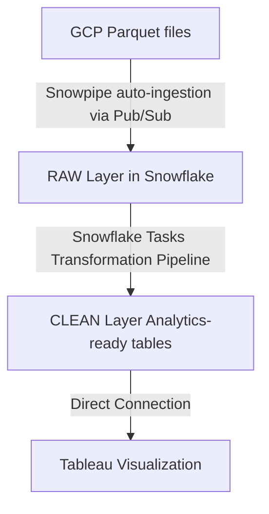
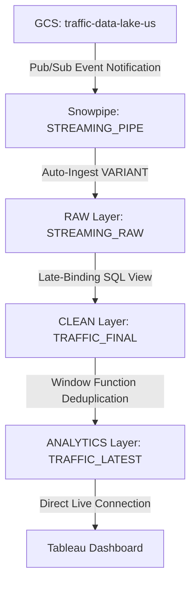

# team6
Repository for team6

# Yelp ETL Pipeline on Google Cloud (Dataproc + GCS)

## Data Source
https://business.yelp.com/data/resources/open-dataset/

---

The entire pipeline can be executed with **a single Unix command**, which launches the Spark workflow automatically.

Components used:
- **Google Cloud Dataproc** – Spark cluster for data processing  
- **Apache Spark (PySpark)** – JSON → Parquet transformation  
- **Google Cloud Storage (GCS)**  – data lake for Parquet files  

---

## Repository Structure

```text
scripts/
    business_only.py
    checkin_only.py
    review_only.py
    tip_only.py
    user_only.py
```
Each Spark script processes a Yelp JSON dataset and converts it into **Parquet format**.

---

## Prerequisites

Before running the pipeline, install:

- **Google Cloud CLI**
- **Access to the GCP project**
- **Permission to run Dataproc workflows**

Required IAM roles: Dataproc Editor, Service Account User, Storage Object Viewer (These have been granted to: rosario@g.ucla.edu and yurikim@g.ucla.edu)

---

### Step 1 — Install Google Cloud CLI

Install the Google Cloud SDK.

### Mac (Homebrew)

```bash
brew install --cask google-cloud-sdk
```

### Linux

```bash
curl https://sdk.cloud.google.com | bash
```

### Windows
Download the installer: https://cloud.google.com/sdk/docs/install

Restart the terminal after installation.


### Step 2 — Authenticate with Google Cloud

```bash
gcloud auth login
```
A browser window will open for authentication.


If `gcloud` is not recognized after installation, reload your shell:

```bash
source ~/.zshrc
```

### Step 3 — Set the Project ID

Set the project used in this pipeline:

```bash
gcloud config set project final-project-489422
```
Verify the active project:

```bash
gcloud config get-value project
```

### Step 4 — Verify the Workflow Template

List available Dataproc workflow templates:

```bash
gcloud dataproc workflow-templates list --region=us-central1
```
You should see:

```text
yelp-etl-workflow
```

### Step 5 — Run the Pipeline (Single Command)

Execute the entire ETL workflow with:

```bash
gcloud dataproc workflow-templates instantiate yelp-etl-workflow --region=us-central1
```

This command automatically performs the following steps:
1. Creates a temporary Dataproc cluster
2. Runs Spark ETL jobs
3. Converts Yelp JSON data into Parquet format
4. Writes the Parquet files to Google Cloud Storage
5. Deletes the cluster after the workflow finishes

---

## Output Location

Processed Parquet files are stored in:

```text
gs://msba405-yelp-data/processed/parquet/
```

Datasets generated:

```text
business/
checkin/
review/
tip/
user/
```

Each dataset contains partitioned Parquet files generated by Spark:

```text
part-00000.parquet
part-00001.parquet
...
_SUCCESS
```
---

## Inspect Output Data

After the workflow finishes, the generated Parquet files are stored in Google Cloud Storage.

You can inspect the output using the **Google Cloud CLI**.

### List all datasets

```bash
gsutil ls gs://msba405-yelp-data/processed/parquet/
```
Expected output:

```text
gs://msba405-yelp-data/processed/parquet/business/
gs://msba405-yelp-data/processed/parquet/checkin/
gs://msba405-yelp-data/processed/parquet/review/
gs://msba405-yelp-data/processed/parquet/tip/
gs://msba405-yelp-data/processed/parquet/user/
```
---

## Download Parquet Files

You can download the generated Parquet files locally using gsutil cp.
Download an entire dataset folder:

```bash
gsutil -m cp -r gs://msba405-yelp-data/processed/parquet/business .
```
This command downloads the folder to your current local directory.

---

## Notes

The Dataproc cluster is created temporarily during execution and automatically deleted after the workflow completes.

Running the workflow again overwrites the existing Parquet files in the output directories.

---

# Yelp Data Warehousing & Analytics (GCP → Snowflake → Tableau)

## Overview

This project builds an end-to-end data pipeline that ingests Yelp data from Google Cloud Storage (GCS) into Snowflake, transforms it into analytics-ready tables, and supports downstream visualization in Tableau.

The pipeline is fully automated using Snowpipe and Snowflake Tasks, ensuring a seamless flow from raw data to actionable business insights.

---

## Architecture



---

## Tech Stack

- **Google Cloud Storage (GCS)** — Data source
- **GCP Pub/Sub** — Event notification
- **Snowflake**
  - Snowpipe (Auto-ingestion)
  - External Stages
  - Tasks (Pipeline orchestration)
- **Tableau** — Data visualization

---

## Data Ingestion (GCP → RAW)

### Storage Integration
Connected Snowflake to GCS using:
- `STORAGE INTEGRATION`
- `NOTIFICATION INTEGRATION` (Pub/Sub)

### External Stages
Each dataset has its own dedicated stage:
- `YELP_BUSINESS_STAGE`
- `YELP_REVIEW_STAGE`
- `YELP_USER_STAGE`
- `YELP_CHECKIN_STAGE`
- `YELP_TIP_STAGE`

### Snowpipes (Auto Ingest)
The following pipes automatically load new Parquet files into RAW tables:
- `PIPE_YELP_BUSINESS`
- `PIPE_YELP_REVIEW`
- `PIPE_YELP_USER`
- `PIPE_YELP_CHECKIN`
- `PIPE_YELP_TIP`

---

## RAW Layer

**Tables:**
- `YELP_BUSINESS`
- `YELP_REVIEW`
- `YELP_USER`
- `YELP_CHECKIN`
- `YELP_TIP`

**Purpose:**
- Store raw, unprocessed data directly from GCS.
- Serve as the immutable source of truth for downstream transformations.

---

## Data Transformation (RAW → CLEAN)

All transformations are implemented using Snowflake Tasks to ensure automated, scheduled processing.

### CLEAN Tables

#### 1. BUSINESS_CLEAN
- Cleaned business data with standardized attributes.
- Used for filtering and ranking businesses.

#### 2. PHILADELPHIA_TOP_BUSINESSES
- Filtered subset of businesses focused exclusively on Philadelphia.
- Supports localized top business analysis.

#### 3. REVIEW_CLEAN
- Standardized review data.
- **Key transformations:**
  - `STARS` → `REVIEW_STARS`
  - Unified timestamps
  - Derived fields: `REVIEW_TIMESTAMP`, `REVIEW_DATE`, `REVIEW_MONTH`, `REVIEW_YEAR`
- Includes engagement metrics: `useful`, `funny`, `cool`.

#### 4. CHECKIN_EVENTS_CLEAN
- Converts raw comma-separated check-in strings into event-level records.
- **Example:** `"2020-01-01,2020-01-02"` → Multiple distinct rows.
- **Implemented using:** `SPLIT()` and `LATERAL FLATTEN`.
- **Derived fields:** `CHECKIN_TIME`, `CHECKIN_DATE`, `CHECKIN_MONTH`.

---

## Pipeline Orchestration (Snowflake Tasks)

### Root Task
- `TASK_REFRESH_BUSINESS_CLEAN`

### Child Tasks
- `TASK_REFRESH_PHILADELPHIA_TOP_BUSINESSES`
- `TASK_REFRESH_CHECKIN_EVENTS_CLEAN`
- `TASK_REFRESH_REVIEW_CLEAN`

### Execution Logic
1. **Root Task Triggered**
2. **Dependent Tasks Execute:** All dependent CLEAN tables refresh automatically in sequence.

This parent-child relationship ensures a fully automated and dependency-aware transformation pipeline.

---

## Validation

### 1. Ingestion Validation (GCP → RAW)
Verified successful data loading using:
```sql
SELECT SYSTEM$PIPE_STATUS('PIPE_NAME');
SELECT * FROM TABLE(COPY_HISTORY(TABLE_NAME=>'TABLE_NAME', START_TIME=> DATEADD(hours, -1, CURRENT_TIMESTAMP())));
```
Example:
```sql
SELECT SYSTEM$PIPE_STATUS('YELP_DB.RAW.PIPE_YELP_BUSINESS');

USE DATABASE YELP_DB;
SELECT *
FROM TABLE(
  YELP_DB.INFORMATION_SCHEMA.COPY_HISTORY(
    TABLE_NAME => 'YELP_DB.RAW.YELP_BUSINESS',
    START_TIME => DATEADD('day', -14, CURRENT_TIMESTAMP()),
    PIPE_NAME => 'YELP_DB.RAW.PIPE_YELP_BUSINESS'
  )
)
ORDER BY LAST_LOAD_TIME DESC;
```

*Results confirmed files successfully loaded with no parsing errors (excluding `_SUCCESS` files).*

### 2. Transformation Validation (RAW → CLEAN)
- All tasks show `SUCCEEDED` in `TASK_HISTORY`.
- CLEAN tables contain properly transformed data.
Example:
```sql
-- business_clean_check
EXECUTE TASK YELP_DB.CLEAN.TASK_REFRESH_BUSINESS_CLEAN;

SELECT *
FROM TABLE(
    YELP_DB.INFORMATION_SCHEMA.TASK_HISTORY(
        TASK_NAME => 'TASK_REFRESH_BUSINESS_CLEAN',
        RESULT_LIMIT => 20
    )
);
```
```sql
SELECT COUNT(*) FROM YELP_DB.CLEAN.REVIEW_CLEAN;
```

### 3. Analytics Readiness
Validated data integrity with aggregations:
```sql
SELECT
  REVIEW_MONTH,
  COUNT(*) AS review_count,
  AVG(REVIEW_STARS)
FROM YELP_DB.CLEAN.REVIEW_CLEAN
GROUP BY REVIEW_MONTH;
```

---

## Tableau Integration

- **Direct Connection:** CLEAN tables are directly used as the data source in Tableau.
- **Architecture Choice:** No additional analytics layer was created — the CLEAN layer serves directly as the data warehouse.
- **Supported Analyses:**
  - Review trends over time
  - Business rankings
  - Check-in activity patterns

---

### Key Features
- **Fully automated ingestion** using Snowpipe.
- **Event-driven architecture** with GCP Pub/Sub.
- **Task-based pipeline orchestration** in Snowflake.
- **Structured CLEAN layer** optimized for analytics.
- **Scalable and modular design.**


# TomTom Traffic Streaming Pipeline on Google Cloud (Workflows + Cloud Run + GCS)

The real-time traffic pipeline continuously collects traffic conditions from the **TomTom Traffic API** and stores the results in the cloud data lake.

The pipeline can be executed with **a single Unix command**, which triggers the workflow orchestrator on Google Cloud.

Components used:

- **Google Cloud Workflows** – pipeline orchestration  
- **Cloud Scheduler** – triggers traffic polling jobs  
- **Cloud Run** – executes the traffic ingestion service  
- **Google Cloud Storage (GCS)** – data lake for Parquet files  
- **Pub/Sub** – event notification system  

---

## Pipeline Architecture

```text
TomTom Traffic API
        │
        ▼
Cloud Scheduler (every 20 minutes)
        │
        ▼
Cloud Run Service (tomtom-polling)
        │
        ▼
Parquet file generation
        │
        ▼
Google Cloud Storage
        │
        ▼
Pub/Sub notification
        │
        ▼
Snowflake Snowpipe ingestion
```

Each execution collects **25 traffic segments** around selected restaurant locations and stores them as **Parquet files** in the data lake.

---

## Data Source

Traffic data is collected from the **TomTom Traffic API**.

Metrics collected include:

```text
currentSpeed
freeFlowSpeed
currentTravelTime
freeFlowTravelTime
confidence
roadClosure
```

Each record is also assigned a **BUSINESS_ID**, allowing the traffic dataset to be joined with Yelp business data.

---

## Prerequisites

Before running the pipeline, install:

- **Google Cloud CLI**
- **Access to the GCP project**
- **Permission to run Google Cloud Workflows**

Required IAM roles:

- Cloud Workflows Invoker  
- Cloud Scheduler Viewer  
- Storage Object Viewer  

---
### Step 1 — Verify the Workflow

List available workflows:

```bash
gcloud workflows list --location=us-west1
```

You should see:

```text
traffic_stream
```

---

### Step 2 — Run the Streaming Pipeline (Single Command)

Execute the streaming workflow with:

```bash
gcloud workflows run traffic_stream --location=us-west1
```

This command automatically performs the following steps:

1. Starts the workflow orchestrator  
2. Activates the Cloud Scheduler job (`traffic-api-poller`)  
3. Calls the Cloud Run service (`tomtom-polling`)  
4. Polls the TomTom Traffic API  
5. Converts the API response to Parquet format  
6. Writes the Parquet file to Google Cloud Storage  
7. Publishes a notification to Pub/Sub  
8. Snowflake Snowpipe automatically ingests the new file  

---

## Output Location

Traffic data is stored in:

```text
gs://traffic-data-lake-us/tomtom/year=YYYY/month=MM/day=DD/
```

Each pipeline execution produces a Parquet file containing **25 traffic records**.

Example output file:

```text
traffic_20260316_210530.parquet
```

---

## Inspect Output Data

After the workflow finishes, the generated Parquet files are stored in Google Cloud Storage.

You can inspect the output using the **Google Cloud CLI**.

### List all traffic data

```bash
gsutil ls gs://traffic-data-lake-us/tomtom/
```

Example output:

```text
gs://traffic-data-lake-us/tomtom/year=2026/
```

---

## Pub/Sub Integration

When new traffic files are written to the bucket, a **Pub/Sub notification** is triggered.

Topic:

```text
projects/fluted-lambda-489221-b8/topics/tomtom-data-topic
```

Subscription used by Snowflake:

```text
projects/fluted-lambda-489221-b8/subscriptions/snowflake-traffic-sub
```

Snowflake Snowpipe listens to this subscription and automatically loads the new traffic data into the warehouse.

---

# TomTom Traffic Data Warehousing & Analytics (GCP → Snowflake → Tableau)

Once the Google Cloud pipeline lands the Parquet files in GCS and triggers the Pub/Sub notification, Snowflake takes over the downstream data modeling.

Unlike the batch processing used for Yelp historical data, this segment utilizes an **event-driven, schema-on-read architecture** to deliver **real-time traffic friction metrics to Tableau with zero manual intervention**.

---

## Downstream Architecture



---

## Snowflake Infrastructure (The GCP Bridge)

To enable seamless automation, Snowflake securely connects to the GCP project **fluted-lambda-489221-b8** without hardcoded credentials.

### External Stage & Integrations

- **Storage Integration (`gcs_role_integration`)**  
  Grants Snowflake access to `gcs://traffic-data-lake-us/`.

- **Notification Integration (`gcp_pubsub_int`)**  
  Listens to the Pub/Sub subscription:  
  `projects/fluted-lambda-489221-b8/subscriptions/snowflake-traffic-sub`

- **External Stage (`MSBA405.RAW.GCS_STAGE`)**  
  Points specifically to the `/tomtom/` directory and parses the Parquet files.

---

### Event-Driven Ingestion (Snowpipe)

**Pipe Name:** `MSBA405.RAW.STREAMING_PIPE`

**Execution**

Configured with:

```
AUTO_INGEST = TRUE
```

As soon as **Cloud Run drops a new Parquet file** and **Pub/Sub fires**, Snowpipe automatically wakes up and executes the `COPY INTO` command within seconds.

---

## Data Modeling Layer

To maintain resilience against upstream **TomTom API schema changes**, we implemented a **Medallion (Multi-Hop) architecture** inside Snowflake.

---

### RAW Layer (`STREAMING_RAW` Table)

**Data Type**

Uses Snowflake's `VARIANT` column to store the raw semi-structured Parquet payload (**schema-on-read**).

**Purpose**

Acts as an **immutable, continuous historical log** of all traffic pulses.

---

### CLEAN Layer (`TRAFFIC_FINAL` View)

Acts as the **normalization engine**, transforming the `VARIANT` JSON into a structured table dynamically.

Key transformations:

- **Explicit Casting**  
  Extracts `currentSpeed`, `freeFlowSpeed`, and `confidence` into `FLOAT / INT`.

- **Spatial Parsing**  
  Splits the raw `coord` string into `lat` and `lon` for Tableau mapping.

- **Timezone Standardization**  
  Converts UTC timestamps to `America/New_York` to align with the **Philadelphia business timezone**.

- **Metric Engineering**  
  Computes the custom **Friction Index**:

```
speed_ratio = currentSpeed / freeFlowSpeed
```

---

### ANALYTICS Layer (`TRAFFIC_LATEST` View)

Because the pipeline polls every **20 minutes**, the RAW table accumulates thousands of historical records per business. Tableau only needs the **current state**.

#### State Management

A **window function** isolates the freshest pulse:

```sql
ROW_NUMBER() OVER (
    PARTITION BY business_id
    ORDER BY event_time DESC
)
```

**Purpose**

Filters the dataset to output exactly one row per business, representing **live physical accessibility at the current moment**.

---

## Validation & Monitoring

### Verify Pipeline Automation (GCP → RAW)

To confirm that **Cloud Workflows successfully triggered Snowpipe ingestion**:

```sql
SELECT SYSTEM$PIPE_STATUS('MSBA405.RAW.STREAMING_PIPE');
```

Verify that the latest file landed in Snowflake and matches the GCS output:

```sql
SELECT
CONVERT_TIMEZONE('America/New_York', 'America/Los_Angeles', event_time) AS last_ingestion_pst,
*
FROM MSBA405.ANALYTICS.TRAFFIC_LATEST;
```

---

### Verify Analytics Layer (RAW → ANALYTICS)

Ensure the **deduplication logic** correctly serves the latest records:

```sql
SELECT
business_id,
current_speed,
ROUND(speed_ratio, 2) AS friction_index,
CONVERT_TIMEZONE('America/New_York', 'America/Los_Angeles', event_time) AS latest_pulse_pst
FROM MSBA405.ANALYTICS.TRAFFIC_LATEST
ORDER BY event_time DESC;
```

---

## Tableau Integration & Business Value

### Direct Live Connection

Tableau connects directly to the `TRAFFIC_LATEST` view.

### No Batch Latency

Because we use **late-binding SQL views instead of scheduled tasks**, there is **zero warehouse processing latency** for the streaming dataset.

### Business Insight

The dashboard converts normalized **lat/lon coordinates** and the **speed_ratio friction metric** into a **live scatter map of Philadelphia**. Decision-makers can instantly identify **which restaurants are currently experiencing severe customer accessibility issues due to traffic bottlenecks**.

---

Tableau Dashborads: 

We delivered 3 Tableau Dashboards:

1. By Category and By State Store Analytical Information Dashboard:
   https://drive.google.com/file/d/16fVY9JgZCnnoMda4FY5qQufRruj-xHVV/view?usp=drive_link
   
2. Store-Search Analytical Information Dashboard:
   https://drive.google.com/file/d/1FiiR-Of3UFsYPWBg31yw52AGEj6Zzvgq/view?usp=drive_link
   
3. Top 5 Store Information with Real-Time Traffic (By Category):
   https://public.tableau.com/app/profile/gexuan.zhu/viz/businesstrafficmap1/Real-TimeBusinessTrafficMapDashboard?publish=yes 
